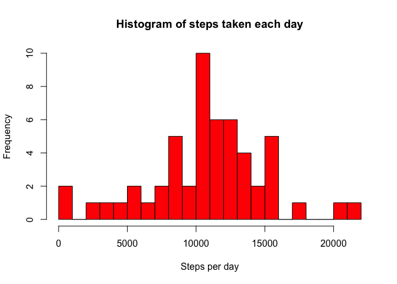

# Reproducible Research: Peer Assessment 1

The following packages are used for this analysis:


```r
library("sqldf")
```

## Loading and preprocessing the data

In order to load the data from "activity.csv", read.csv will is used:


```r
act <- read.csv("activity.csv")
head(act)
```

```
##   steps       date interval
## 1    NA 2012-10-01        0
## 2    NA 2012-10-01        5
## 3    NA 2012-10-01       10
## 4    NA 2012-10-01       15
## 5    NA 2012-10-01       20
## 6    NA 2012-10-01       25
```

No additional data transformation is needed at this moment.

## What is mean total number of steps taken per day?

We proceed to count the steps per day:


```r
steps_per_day <- sqldf('select date,sum(steps) step_count from act group by date order by date')
head(steps_per_day)
```

```
##         date step_count
## 1 2012-10-01       <NA>
## 2 2012-10-02        126
## 3 2012-10-03      11352
## 4 2012-10-04      12116
## 5 2012-10-05      13294
## 6 2012-10-06      15420
```

Histogram showing the total number of steps taken each day:


```r
hist(as.numeric(steps_per_day$step_count), 
     main="Histogram of steps taken each day", xlab="Steps per day", col="red", breaks=30)
```

 

The mean number of steps is:


```r
mean(as.numeric(steps_per_day$step_count), na.rm=TRUE)
```

```
## [1] 10766.19
```

The median number of steps is:


```r
median(as.numeric(steps_per_day$step_count), na.rm=TRUE)
```

```
## [1] 10765
```

## What is the average daily activity pattern?

The following is a time series plot that represents the 5-minute interval (x-axis) and the average number of steps taken, averaged across all days (y-axis):


```r
avg_steps_interval <- sqldf("select avg(steps) avg_steps, interval 
                                from act where steps is not null group by interval order by interval")

plot(avg_steps_interval$interval, avg_steps_interval$avg_steps, type="l", 
     main="Average number of steps per 5 min intervals", 
     xlab="Time of Day Format(5 minute interval in format HH24MI)", 
     ylab="Average number of steps taken")
```

 

The following answers which 5-minute interval, on average across all the days in the dataset, contains the maximum number of steps:


```r
max_int <- sqldf("select max(avg_steps) max_avg_steps, interval from avg_steps_interval")
print(max_int$interval)
```

```
## [1] 835
```

In conclusion, on average the interval 835 contains the maximum number of steps wit 206.1698113 steps.

## Imputing missing values

The total number of missing values in the activity.csv dataset is:


```r
sum(is.na(act$steps))
```

```
## [1] 2304
```

It can also be calculated with an SQL expression:


```r
sqldf("select count(1) NA_count from act where steps is null")
```

```
##   NA_count
## 1     2304
```

The number of NA is evenly distributed accross all intervals, each interval has 8 NA:

```r
head(sqldf("select interval, count(1) count from act where steps is null group by interval order by 2 desc"))
```

```
##   interval count
## 1        0     8
## 2        5     8
## 3       10     8
## 4       15     8
## 5       20     8
## 6       25     8
```

```r
sqldf("select max(count), min(count) from (select interval, count(1) count from act where steps is null group by interval)")
```

```
##   max(count) min(count)
## 1          8          8
```

For this reason, all NA will me replaced by the interval mean. Here is the new dataset with all the NA values replaced:

```r
act2 <- act
act2$steps[is.na(act2$steps)] <- mean(act$steps, na.rm=T)
head(act2)
```

```
##     steps       date interval
## 1 37.3826 2012-10-01        0
## 2 37.3826 2012-10-01        5
## 3 37.3826 2012-10-01       10
## 4 37.3826 2012-10-01       15
## 5 37.3826 2012-10-01       20
## 6 37.3826 2012-10-01       25
```

We proceed to count the steps per day:


```r
steps_per_day2 <- sqldf('select date,sum(steps) step_count from act2 group by date order by date')
head(steps_per_day2)
```

```
##         date step_count
## 1 2012-10-01   10766.19
## 2 2012-10-02     126.00
## 3 2012-10-03   11352.00
## 4 2012-10-04   12116.00
## 5 2012-10-05   13294.00
## 6 2012-10-06   15420.00
```

Histogram showing the total number of steps taken each day:


```r
hist(as.numeric(steps_per_day2$step_count), 
     main="Histogram of steps taken each day, no NA values", xlab="Steps per day", col="blue", breaks=30)
```

 

The mean number of steps is:


```r
mean(as.numeric(steps_per_day2$step_count), na.rm=TRUE)
```

```
## [1] 10766.19
```

The median number of steps is:


```r
median(as.numeric(steps_per_day2$step_count), na.rm=TRUE)
```

```
## [1] 10766.19
```

After replacing the NA values, the mean remains the same. The median does change and is now equal to the mean.


## Are there differences in activity patterns between weekdays and weekends?
